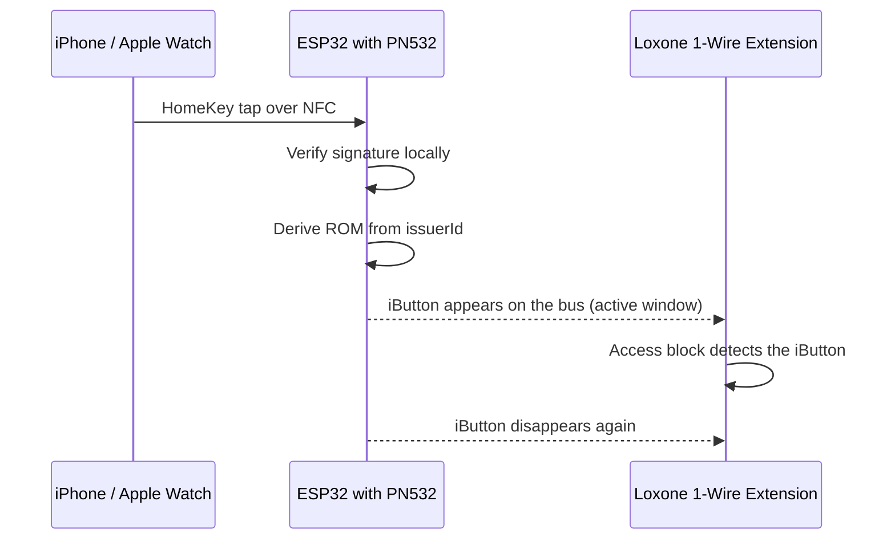
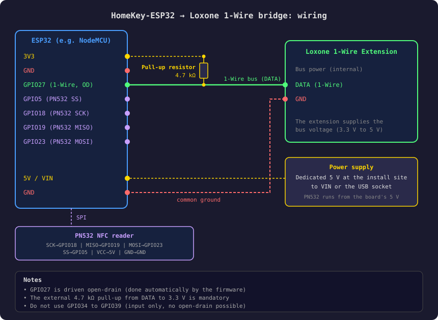

# Loxone 1-Wire Bridge

[Deutsch](LOXONE_INTEGRATION.md) | **English**

After a successful HomeKey tap, a virtual **Dallas DS1990A iButton** briefly appears on the 1-Wire bus. A Loxone
1-Wire Extension sees it as an iButton being presented and removed, and opens the door through the access block.
Hold an Apple device to the reader and the door opens, with no cloud and no MQTT broker.

- [Quick start](#quick-start)
- [How it works](#how-it-works)
- [Hardware and wiring](#hardware-and-wiring)
- [Firmware](#firmware)
- [Setup](#setup)
- [Security](#security)
- [Troubleshooting](#troubleshooting)
- [Appendix: ROM layout](#appendix-rom-layout)

## Quick start

1. **Wire it** as [shown below](#hardware-and-wiring): GPIO27 to DATA, 4.7 kΩ pull-up to 3.3 V, common ground.
2. **Flash the firmware** from the [`loxone-latest`](../../../releases/tag/loxone-latest) release, either
   [over the air](#update-over-the-air-recommended) (`esp32-loxone.firmware.ota.bin` and `littlefs.bin`) or, for a
   first install, [over USB](#first-install-over-usb).
3. **Check:** open the **Loxone** page of the web UI. The defaults match the wiring above.
4. **Add a person:** start the 1-Wire search in Loxone Config, hold the Apple device to the reader and assign the
   ROM that shows up to the access block. See [Add a person in Loxone](#add-a-person-in-loxone).

> [!NOTE]
> The code lives in its own component, `components/loxone_onewire/`, and is only part of the build with
> `CONFIG_LOXONE_ONEWIRE=y`. The technical reference (Kconfig, layout, tests) is in the
> [component README](../components/loxone_onewire/README.md).

## How it works



The ROM is derived **deterministically**: `0x01`, the first six bytes of the `issuerId` and a CRC8. The same Apple ID
always yields the same ROM. The assignment in Loxone survives reboots and reflashing, and there is no mapping
table. Alternatively the ROM can be derived from the `endpointId` (one per device).

| ROM source | Applies to | Use |
|------------|------------|-----|
| `issuerId` (default) | all devices of one Apple ID (iPhone, Watch, iPad) | one Loxone rule per person |
| `endpointId` | a single device | grant or revoke access per device |

Example with fictional values:

```
issuerId:  aa bb cc dd ee ff 00 11
ROM:       01 aa bb cc dd ee ff 2f      (2f = CRC8 over the first seven bytes)
```

It works entirely without WiFi: the HomeKey check and the ROM derivation run locally on the ESP32. WiFi is only needed
for setup and the web UI.

## Hardware and wiring

| Part | Description |
|------|-------------|
| ESP32 (WROOM, e.g. NodeMCU) | microcontroller |
| PN532 NFC reader | reads HomeKey over NFC (SPI) |
| 4.7 kΩ resistor | pull-up for the 1-Wire bus, DATA to 3.3 V |
| 100 µF electrolytic capacitor | between 3.3 V and GND, steadies the supply while WiFi connects |
| Loxone 1-Wire Extension | reads the emulated iButton |
| 5 V power supply, at least 1 A | dedicated supply at the install site |



> [!IMPORTANT]
> GPIO27 is driven open-drain, so the external 4.7 kΩ pull-up is mandatory. GPIO34 to GPIO39 are unsuitable for the
> bus (input only). The firmware reserves the pin with the GPIO allocator so no other feature can claim it.

## Firmware

Ready-made builds for the classic ESP32 are in the [`loxone-latest`](../../../releases/tag/loxone-latest) release.
The [`loxone-build.yml`](../.github/workflows/loxone-build.yml) workflow builds them on every push to `main`.

| File | Use |
|------|-----|
| `esp32-loxone.firmware.ota.bin` | firmware over the air |
| `littlefs.bin` | web UI over the air, contains the Loxone page |
| `esp32-loxone.firmware.factory.bin` | USB only, **erases settings and HomeKit pairing** |

### Update over the air (recommended)

1. Open the web UI and go to **OTA Update**.
2. Select `esp32-loxone.firmware.ota.bin` and `littlefs.bin`, then click **Upload Both**.
3. The device reboots. Reload the browser with Ctrl+Shift+R, otherwise it may still show the old interface.

Settings, WiFi and HomeKit pairing are kept. Bootloader rollback is enabled: if the new firmware does not start
cleanly, the device boots the previous one again.

> [!TIP]
> If the Loxone page shows `Invalid 'type' parameter`, the old interface is still running. Upload `littlefs.bin`
> again, or as a fallback use `espota` (default OTA password `homespan-ota`):
>
> ```bash
> python espota.py -r -i <IP> -a homespan-ota -f littlefs.bin -s
> ```
>
> The `-s` selects the filesystem partition instead of the firmware.

### First install over USB

```bash
esptool.py --chip esp32 -p <PORT> write_flash 0x0 esp32-loxone.firmware.factory.bin
```

Then set up WiFi and HomeKit pairing as described in the [regular documentation](content/setup.md).

### Build it yourself

Enable it in `menuconfig` under **Loxone 1-Wire bridge**, or set `CONFIG_LOXONE_ONEWIRE=y` in an
`sdkconfig.defaults` overlay. The repository ships `sdkconfig.defaults.loxone` for that:

```bash
idf.py -D SDKCONFIG_DEFAULTS="sdkconfig.defaults;sdkconfig.defaults.loxone" build
```

## Setup

The **Loxone** page of the web UI holds all settings. Saving reboots the device, because the bus is set up at boot.

| Setting | Default | Description |
|---------|---------|-------------|
| Enable | on | enable the 1-Wire emulation |
| GPIO Pin | 27 | pin of the 1-Wire line, must be output capable |
| Active Window | 3000 ms | how long the iButton stays visible after a tap, 500 to 4500 ms |
| ROM Source | `issuerId` | `issuerId` per Apple ID, `endpointId` per device |

> [!NOTE]
> The active window is capped at 4500 ms. The bus task polls the pin while the iButton is visible and never blocks.
> A longer window would starve the idle task of its core and trip the task watchdog (default 5 s). Loxone polls about
> once per second, so 3000 ms gives two to three cycles.

### Add a person in Loxone

1. Open the 1-Wire Extension in Loxone Config and start the **1-Wire search**.
2. Hold the Apple device to the PN532 while the search is running.
3. The ROM shows up in the results. It is also in the log: `HomeKey tap, ROM from issuerId: 01…`.
4. Assign the ROM to the access block. The next tap opens the door.

## Security

> [!WARNING]
> An iButton ROM is an **identifier, not a secret**, and a 1-Wire bus has no authentication. Anyone who knows the ROM
> and can reach the bus can present the same iButton. That is why the ROM appears in the log and on the wire. Keep the
> bus wiring physically protected. The bridge is unsuitable where the 1-Wire cable is reachable from outside.

| Aspect | Note |
|--------|------|
| HomeKey | cryptographic signature check on the ESP32 |
| 1-Wire | wired, no radio link between ESP32 and Loxone |
| Web UI | local network only, credentials can be enabled in the Misc settings |
| ROM derivation | the same Apple ID yields the same ROM, one Apple ID per person yields one permission per person |

## Troubleshooting

| Problem | Check |
|---------|-------|
| Loxone does not see the iButton | 4.7 kΩ pull-up present? Common ground? Correct pin on the Loxone page? |
| State change does not trigger | Increase the active window (maximum 4500 ms), check the polling interval in Loxone |
| No `HomeKey tap` in the log | Check the PN532 SPI pins and the power supply |
| Loxone page shows `Invalid 'type' parameter` | old interface, flash `littlefs.bin` again and hard-reload the browser |
| Loxone page says "not part of this firmware" | firmware was built without `CONFIG_LOXONE_ONEWIRE` |
| Timing problems on the bus | keep the cable under 30 m, set the task core to 0 via `CONFIG_LOXONE_ONEWIRE_TASK_CORE` |
| Device does not boot cleanly without USB | the upstream solution applies (GPIO3 pull-up, console optional), check `CONFIG_INIT_ARDU_SERIAL_LOGGING` |

## Appendix: ROM layout

| Byte | Content |
|------|---------|
| 0 | `0x01`, DS1990A family code |
| 1 to 6 | first six bytes of the `issuerId` (or `endpointId`) |
| 7 | Dallas/Maxim CRC8 over the first seven bytes |
