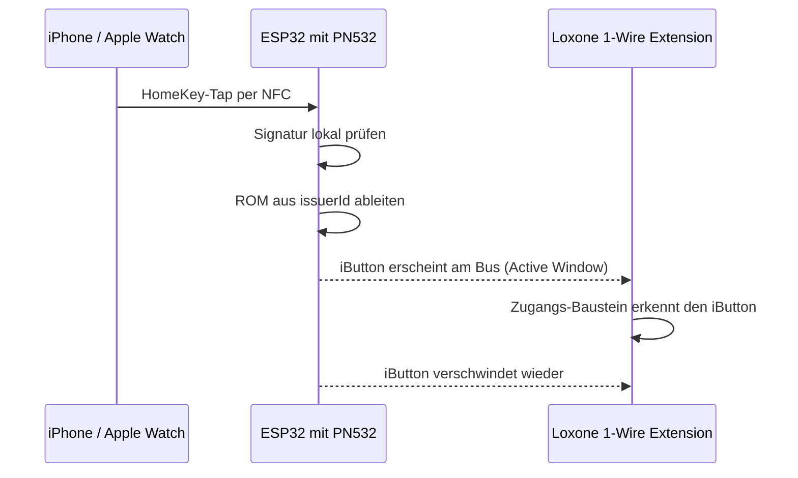
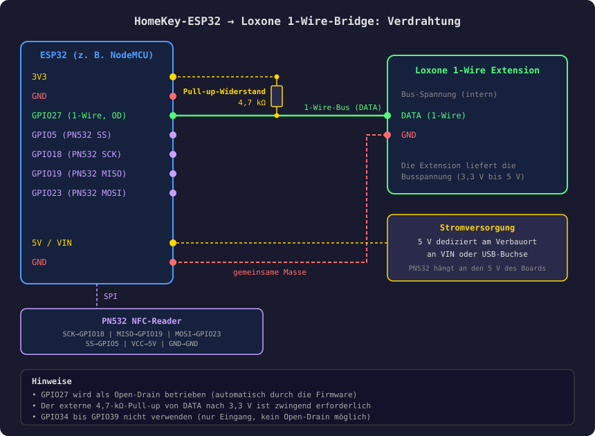

# Loxone 1-Wire Bridge

**Deutsch** | [English](LOXONE_INTEGRATION.en.md)

Nach einem erfolgreichen HomeKey-Tap erscheint am 1-Wire-Bus kurz ein virtueller **Dallas DS1990A iButton**. Eine
Loxone 1-Wire Extension sieht das wie einen aufgelegten und wieder entfernten iButton und öffnet über den
Zugangs-Baustein die Tür. Apple-Gerät an den Reader halten, Tür geht auf, ohne Cloud und ohne MQTT-Broker.

- [Schnellstart](#schnellstart)
- [Funktionsweise](#funktionsweise)
- [Hardware und Verdrahtung](#hardware-und-verdrahtung)
- [Firmware](#firmware)
- [Einrichtung](#einrichtung)
- [Sicherheit](#sicherheit)
- [Fehlersuche](#fehlersuche)
- [Anhang: ROM-Aufbau](#anhang-rom-aufbau)

## Schnellstart

1. **Verdrahten** wie [unten](#hardware-und-verdrahtung): GPIO27 an DATA, 4,7-kΩ-Pull-up nach 3,3 V, gemeinsame Masse.
2. **Firmware aufspielen:** aus dem Release [`loxone-latest`](../../../releases/tag/loxone-latest) per
   [OTA](#update-per-ota-empfohlen) (`esp32-loxone.firmware.ota.bin` und `littlefs.bin`) oder erstmalig per
   [USB](#erstinstallation-per-usb).
3. **Prüfen:** In der Web-UI die Seite **Loxone** öffnen. Die Standardwerte passen für die Verdrahtung oben.
4. **Person anlegen:** In Loxone Config die 1-Wire-Suche starten, Apple-Gerät an den Reader halten und die
   gefundene ROM dem Zugangs-Baustein zuweisen. Details unter [Person in Loxone anlegen](#person-in-loxone-anlegen).

> [!NOTE]
> Der Code liegt als eigene Komponente in `components/loxone_onewire/` und ist nur mit `CONFIG_LOXONE_ONEWIRE=y`
> im Build. Die technische Referenz (Kconfig, Aufbau, Tests) steht in der
> [Komponenten-README](../components/loxone_onewire/README.md) (englisch).

## Funktionsweise



Die ROM wird **deterministisch** abgeleitet: `0x01`, die ersten sechs Bytes der `issuerId` und eine CRC8. Dieselbe
Apple-ID ergibt immer dieselbe ROM. Die Zuordnung in Loxone überlebt Neustarts und Reflash, eine Mapping-Tabelle
gibt es nicht. Alternativ lässt sich die ROM aus der `endpointId` ableiten (eine pro Gerät).

| ROM-Quelle | gilt für | Verwendung |
|------------|----------|------------|
| `issuerId` (Standard) | alle Geräte einer Apple-ID (iPhone, Watch, iPad) | eine Loxone-Regel pro Person |
| `endpointId` | ein einzelnes Gerät | Zugang pro Gerät erteilen oder entziehen |

Beispiel mit fiktiven Werten:

```
issuerId:  aa bb cc dd ee ff 00 11
ROM:       01 aa bb cc dd ee ff 2f      (2f = CRC8 über die ersten sieben Bytes)
```

Ohne WLAN funktioniert das vollständig: Die HomeKey-Prüfung und die ROM-Ableitung laufen lokal auf dem ESP32. WLAN wird
nur für die Einrichtung und die Web-UI gebraucht.

## Hardware und Verdrahtung

| Komponente | Beschreibung |
|------------|--------------|
| ESP32 (WROOM, z. B. NodeMCU) | Mikrocontroller |
| PN532 NFC-Reader | liest HomeKey per NFC (SPI) |
| 4,7 kΩ Widerstand | Pull-up für den 1-Wire-Bus, DATA nach 3,3 V |
| 100 µF Elko | zwischen 3,3 V und GND, stabilisiert die Versorgung beim WLAN-Aufbau |
| Loxone 1-Wire Extension | liest den emulierten iButton |
| 5-V-Netzteil, mindestens 1 A | eigene Versorgung am Verbauort |



> [!IMPORTANT]
> GPIO27 wird als Open-Drain betrieben, der externe 4,7-kΩ-Pull-up ist zwingend. GPIO34 bis GPIO39 sind für den Bus
> ungeeignet (nur Eingang). Die Firmware reserviert den Pin beim GPIO-Allocator, damit ihn keine andere Funktion belegt.

## Firmware

Fertige Builds für den klassischen ESP32 liegen im Release
[`loxone-latest`](../../../releases/tag/loxone-latest). Der Workflow
[`loxone-build.yml`](../.github/workflows/loxone-build.yml) baut sie bei jedem Push auf `main`.

| Datei | Verwendung |
|-------|------------|
| `esp32-loxone.firmware.ota.bin` | Firmware per OTA |
| `littlefs.bin` | Web-UI per OTA, enthält die Loxone-Seite |
| `esp32-loxone.firmware.factory.bin` | nur per USB, **löscht Einstellungen und HomeKit-Pairing** |

### Update per OTA (empfohlen)

1. Web-UI öffnen, Seite **OTA Update**.
2. `esp32-loxone.firmware.ota.bin` und `littlefs.bin` wählen, **Upload Both** klicken.
3. Das Gerät startet neu. Den Browser mit Strg+Shift+R neu laden, sonst zeigt er unter Umständen noch die alte Oberfläche.

Einstellungen, WLAN und HomeKit-Pairing bleiben erhalten. Der Bootloader-Rollback ist aktiv: Startet die neue
Firmware nicht sauber, bootet das Gerät die vorherige wieder.

> [!TIP]
> Zeigt die Loxone-Seite `Invalid 'type' parameter`, läuft noch die alte Oberfläche. Dann `littlefs.bin` erneut
> hochladen, notfalls per `espota` (Standard-OTA-Passwort `homespan-ota`):
>
> ```bash
> python espota.py -r -i <IP> -a homespan-ota -f littlefs.bin -s
> ```
>
> Das `-s` wählt die Dateisystem-Partition statt der Firmware.

### Erstinstallation per USB

```bash
esptool.py --chip esp32 -p <PORT> write_flash 0x0 esp32-loxone.firmware.factory.bin
```

Danach WLAN und HomeKit-Kopplung wie in der [normalen Dokumentation](content/setup.md) einrichten.

### Selbst bauen

In `menuconfig` unter **Loxone 1-Wire bridge** aktivieren oder in einer `sdkconfig.defaults`-Ergänzung
`CONFIG_LOXONE_ONEWIRE=y` setzen. Das Repository enthält dafür `sdkconfig.defaults.loxone`:

```bash
idf.py -D SDKCONFIG_DEFAULTS="sdkconfig.defaults;sdkconfig.defaults.loxone" build
```

## Einrichtung

Die Seite **Loxone** in der Web-UI enthält alle Einstellungen. Speichern startet das Gerät neu, weil der Bus beim
Boot aufgebaut wird.

| Einstellung | Standard | Beschreibung |
|-------------|----------|--------------|
| Enable | an | 1-Wire-Emulation aktivieren |
| GPIO Pin | 27 | Pin der 1-Wire-Leitung, muss ausgabefähig sein |
| Active Window | 3000 ms | Zeit, die der iButton nach dem Tap sichtbar ist, 500 bis 4500 ms |
| ROM Source | `issuerId` | `issuerId` pro Apple-ID, `endpointId` pro Gerät |

> [!NOTE]
> Das Active Window ist auf 4500 ms begrenzt. Der Bus-Task pollt den Pin, solange der iButton sichtbar ist, und
> blockiert dabei nie. Länger würde den Idle-Task seines Kerns verhungern lassen und den Task-Watchdog auslösen
> (Standard 5 s). Loxone fragt etwa einmal pro Sekunde ab, 3000 ms ergeben zwei bis drei Zyklen.

### Person in Loxone anlegen

1. In Loxone Config die 1-Wire Extension öffnen und die **1-Wire Suche** starten.
2. Das Apple-Gerät an den PN532 halten, während die Suche läuft.
3. Die ROM erscheint in den Ergebnissen. Sie steht auch im Log: `HomeKey tap, ROM from issuerId: 01…`.
4. Die ROM dem Zugangs-Baustein zuweisen. Der nächste Tap öffnet die Tür.

## Sicherheit

> [!WARNING]
> Eine iButton-ROM ist eine **Kennung, kein Geheimnis**, und ein 1-Wire-Bus kennt keine Authentifizierung. Wer die ROM
> kennt und an den Bus kommt, kann denselben iButton nachbilden. Die ROM steht deshalb im Log und liegt auf der
> Leitung. Die Busverdrahtung muss physisch geschützt sein. Die Bridge ist ungeeignet, wo die 1-Wire-Leitung von
> außen erreichbar ist.

| Aspekt | Hinweis |
|--------|---------|
| HomeKey | kryptografische Prüfung der Signatur auf dem ESP32 |
| 1-Wire | kabelgebunden, kein Funk zwischen ESP32 und Loxone |
| Web-UI | nur im lokalen Netz, Zugangsdaten lassen sich in den Misc-Einstellungen aktivieren |
| ROM-Ableitung | dieselbe Apple-ID ergibt dieselbe ROM, je Person eine eigene Apple-ID ergibt eine eigene Berechtigung |

## Fehlersuche

| Problem | Prüfung |
|---------|---------|
| Loxone erkennt den iButton nicht | Pull-up 4,7 kΩ vorhanden? Gemeinsame Masse? Richtiger Pin auf der Loxone-Seite? |
| Zustandsänderung triggert nicht | Active Window erhöhen (maximal 4500 ms), Abfrageintervall in Loxone prüfen |
| Kein `HomeKey tap` im Log | PN532-SPI-Pins und Stromversorgung prüfen |
| Loxone-Seite zeigt `Invalid 'type' parameter` | alte Oberfläche, `littlefs.bin` erneut flashen und den Browser hart neu laden |
| Loxone-Seite meldet "not part of this firmware" | Firmware ohne `CONFIG_LOXONE_ONEWIRE` gebaut |
| Timing-Probleme auf dem Bus | Leitung unter 30 m halten, Task-Kern über `CONFIG_LOXONE_ONEWIRE_TASK_CORE` auf 0 stellen |
| Gerät bootet ohne USB nicht sauber | Es gilt die Upstream-Lösung (GPIO3-Pull-up, Konsole optional), `CONFIG_INIT_ARDU_SERIAL_LOGGING` prüfen |

## Anhang: ROM-Aufbau

| Byte | Inhalt |
|------|--------|
| 0 | `0x01`, Familiencode DS1990A |
| 1 bis 6 | erste sechs Bytes der `issuerId` (oder `endpointId`) |
| 7 | CRC8 nach Dallas/Maxim über die ersten sieben Bytes |
